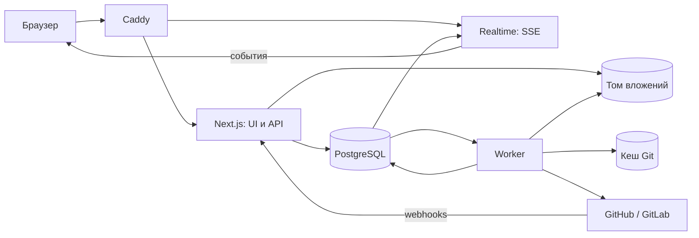

# ADR-0001. Архитектура PushDocs

PushDocs разрабатывается как CMS для существующих проектов Docusaurus с установкой на собственном сервере. Предлагается модульный монолит на Next.js с отдельными процессами фоновых задач и доставки событий. Git хранит закоммиченные документы, а PostgreSQL хранит черновики, доступы, обсуждения и состояние операций.

Документ определяет архитектуру первой полноценной версии. Решение принято 7 сентября 2026 года. В репозитории реализован рабочий MVP, а отличия от полной версии перечислены ниже. Название PushDocs взято из текущего репозитория.

Уточнение от 8 сентября 2026 года: актуальный [план доработки](../development-plan.md) предусматривает конфигурацию особенностей репозитория без отдельного адаптера sendsay-docs и обязательный точный preview черновиков до коммита. Положения ниже о специальном адаптере и достаточности только CI-preview требуют пересмотра. Исполнение сайта в отдельном runner будет описано дополнительным ADR до реализации.

## Состояние реализации

MVP поддерживает несколько проектов, GitHub и GitLab, включая GitLab Self-Managed. Реализованы импорт веток, черновики Markdown и MDX, создание документов, загрузка вложений, внутренние комментарии, роли, приглашения и обновления через SSE. Worker отправляет набор файлов одним коммитом с проверкой SHA ветки, создаёт PR или MR, получает проверки и переводит изменившиеся файлы в интерфейс разрешения конфликтов.

В MVP слияние выполняется в интерфейсе провайдера. Комментарии GitHub и GitLab пока не синхронизируются с внутренними комментариями, а состояния PR и MR обновляются опросом раз в 30 секунд без webhook. Предпросмотр не исполняет компоненты подключённого репозитория и показывает для них безопасные блоки. Эти ограничения сохраняют границы доверия, но требуют следующих этапов разработки перед production-релизом.

## Контекст и требования

Продуктовый ориентир, [Dhub](https://dhub.dev/), предлагает визуальное редактирование Markdown/MDX и работу с GitHub. PushDocs должен предоставлять похожий редактор для Docusaurus, поддерживать GitLab и работать на инфраструктуре владельца.

| Требование | Решение первой версии |
| --- | --- |
| Установка на собственном сервере | Docker Compose, PostgreSQL, постоянные тома, первый запуск и обновление без обязательных облачных сервисов |
| Несколько проектов в одной установке | Общие сервисы установки, отдельные профили, ветки, черновики, подключения и операции каждого проекта |
| Несколько веток одновременно | Независимые наборы изменений и состояние редактора для каждой ветки, включая несколько вкладок браузера |
| GitHub и GitLab | GitHub.com, GitLab.com и несколько экземпляров GitLab Self-Managed с собственными адресами и сертификатами |
| Конфликты в интерфейсе | Сравнение трёх версий текста, ручной итог, выбор файла для бинарных конфликтов, проверка актуальности решения |
| Пользовательские компоненты | Каталог компонентов, формы свойств, вложенное содержимое и сохранение неподдерживаемого MDX через исходник |
| Проверки PR/MR | Статусы, вывод и аннотации в доступном API объёме, связь с ревизией, ссылки на полный результат |
| Комментарии | Обсуждения внутри CMS, чтение и явная отправка комментариев в PR/MR |
| Обновления в реальном времени | Статусы, обсуждения, изменения веток и прав доступа через SSE |
| Файлы и изображения | Загрузка, предпросмотр, вставка ссылок и отправка вместе с документом одним коммитом |
| Несколько пользователей | Приглашения и три фиксированные роли с проверкой прав на сервере |
| Стек | Yarn, Next.js, TypeScript, PostgreSQL, Docker Compose, Base UI |

Пользователь подтвердил, что одновременное посимвольное редактирование и общие курсоры не требуются. Также подтверждены роли «Администратор», «Редактор» и «Читатель», причём читатель может оставлять комментарии.

Термины «ветка», «версия документации», «набор изменений» и «запрос на слияние» имеют разные значения. Определения находятся в [словаре проекта](../../CONTEXT.md).

## Связь с предыдущими проектами

Решения основаны на просмотре инструкций, зависимостей, конфигурации развёртывания и выбранных модулей Selflify, selfchecks и appnotes на 7 сентября 2026 года. В таблице отделены уже применённые подходы от предлагаемых изменений.

| Проект и изученные файлы | Используемый подход | Применение в PushDocs |
| --- | --- | --- |
| Selflify: `AGENTS.md`, `package.json`, `src/lib/operations.ts` | Next.js App Router, Yarn 4, типизированные сервисы, проверка ревизии перед изменением, журнал результата операции | Тонкие HTTP-обработчики, `expectedRevision`, отдельное состояние долгих операций и восстановление после сбоя |
| Selflify: `README.md`, `AGENTS.md` | Первый запуск, Caddy, отдельные dev/prod Compose, проверка установки | Аналогичный путь установки, безопасный bootstrap и smoke-тест полного стека |
| selfchecks: `package.json`, `apps/web/package.json`, `packages/db/package.json` | Yarn workspaces, Next.js, отдельные web/worker, PostgreSQL и миграции | Монорепозиторий и worker для Git, интеграций и обработки вложений |
| selfchecks: `README.md` | Установка через bootstrap-архив, PostgreSQL, Redis и Caddy | Повторяемый bootstrap; потребность в Redis оценивается отдельно |
| appnotes: `docs/runtime-architecture.md`, `apps/api/src/database/domain-events.ts`, `apps/realtime/src/event-source.ts` | Разделение domain/core/contracts, транзакционные события, уведомление клиентов и повторное чтение данных | Явные границы модулей, журнал событий PostgreSQL и realtime без пересылки полного содержимого документов |
| appnotes: `deploy/selfhost/compose.yml`, `packages/ui/src/components/button.tsx`, `.yarnrc.yml` | Один внешний origin, разные процессы и права БД, общий UI-пакет, Yarn с `node-modules` | Один адрес CMS, отдельный realtime, централизованные UI-компоненты поверх Base UI |

PushDocs использует PostgreSQL вместо JSON-конфига Selflify, поскольку черновики и комментарии требуют транзакций. Для первой версии достаточно очереди в PostgreSQL, поэтому Redis/BullMQ из selfchecks не переносится. API размещается в Next.js, а отдельный NestJS-сервис из appnotes пока не требуется. SSE заменяет WebSocket, поскольку обновления идут от сервера к клиенту.

Из старых проектов переносим архитектурные приёмы. Их Chakra UI и Radix-компоненты заменяются собственным набором на Base UI согласно выбранному стеку.

## Границы первой версии

Одна установка обслуживает несколько проектов с общими учётными записями пользователей и подключениями к Git-провайдерам. Доступ и роли назначаются отдельно в каждом проекте. Проект указывает на один сайт Docusaurus и его корень в репозитории. Несколько сайтов монорепозитория подключаются как отдельные проекты.

Согласована структура `Установка → Проекты → Ветки → Документы`. Рабочие области не вводятся: независимые организации в одной установке не требуются, а разные составы участников поддерживаются доступом на уровне проекта.

Поддержка нескольких проектов обязательна уже в первой версии. Один Compose-стек обслуживает одновременно, например, sendsay-docs в собственном GitLab и другой сайт документации в GitHub. Для каждого проекта не требуется отдельная установка, база данных или домен CMS.

Редактор работает с документами, front matter, изображениями и объявленными компонентами. В рамках проекта поддерживаются несколько наборов docs, языков и версий Docusaurus. Корни содержимого задаются явно, если автоматическое определение неоднозначно. Проект `sendsay-docs` является обязательным контрольным примером совместимости; особенности зафиксированы в [анализе импорта](../compatibility/sendsay-docs.md).

Полная версия включает оба Git-провайдера, разрешение конфликтов, вложения, комментарии и realtime. Этапы ниже определяют порядок реализации, а не перенос обязательных возможностей на неопределённое будущее.

В первую версию не входят синхронное редактирование текста, автономная работа без сети, конструктор произвольных ролей, собственный CI и хостинг опубликованного сайта. Создание React-компонентов остаётся задачей разработчиков репозитория. GitHub Enterprise Server, Git LFS и редактирование submodule рассматриваются отдельно.

## Структура приложения и стек

Выбирается Yarn 4 с зафиксированной версией `packageManager`, `yarn.lock` и `nodeLinker: node-modules`, как в предыдущих проектах. Установка в CI использует `yarn install --immutable`. Базовые линии, Next.js 16 и React 19, уже используются в appnotes; конкретные поддерживаемые исправленные версии фиксируются при bootstrap. Node.js выбирается из поддерживаемой LTS-линии, совместимой с зависимостями. Версии относятся к самой CMS. Импортируемый сайт сохраняет свой Yarn, React, Docusaurus и lockfile; переход sendsay-docs с Yarn 1 и React 18 для импорта не требуется.

PostgreSQL 17 принимается начальной основной версией по аналогии с self-hosted appnotes. Для доступа выбираются Kysely и `pg`, а изменения схемы выполняются версионированными миграциями. SQL нужен для условных обновлений, блокировок и очереди задач. Kysely уже используется в appnotes и позволяет держать такие запросы явными.

Base UI (`@base-ui/react`) предоставляет интерактивные примитивы. Собственные стили, CSS-переменные и Tailwind формируют внешний вид в `packages/ui`. Base UI не задаёт визуальный стиль приложения. См. [официальное руководство Base UI](https://base-ui.com/react/overview/quick-start).

```text
apps/
  web/                 Next.js App Router, страницы и HTTP API
  worker/              Git, провайдеры, вложения, фоновые задачи
  realtime/            SSE, подписки, проверка доступа, доставка событий
packages/
  domain/              Правила ролей, веток, публикации и конфликтов
  core/                Прикладные сценарии и интерфейсы внешних зависимостей
  contracts/           Схемы запросов, ответов, ошибок и событий
  db/                  Kysely, миграции, хранилища и очередь PostgreSQL
  providers/           Адаптеры API GitHub и GitLab, чтение и условная запись
  content/             Docusaurus, Markdown/MDX и конфигурация компонентов
  ui/                  Base UI, стили и общие элементы интерфейса
deploy/                Конфигурация Caddy
Dockerfile             Сборка web, worker и realtime
compose.yml            PostgreSQL, миграции и процессы приложения
docs/adr/              Архитектурные решения
```

`domain` не зависит от React, Next.js, SQL или Git SDK. `core` использует `domain`, контракты и узкие интерфейсы хранилищ, Git и провайдеров. Адаптеры реализуют интерфейсы, а приложения связывают зависимости. HTTP-обработчики проверяют ввод и вызывают прикладной сценарий, но не содержат алгоритмы слияния.

Server Components используются для оболочки и первоначальных данных. Редактор и обсуждения являются клиентскими компонентами. Изменяемые приватные данные читаются без общего серверного кеша и обновляются после доменных событий.

Формы MVP используют Server Actions, которые вызывают сценарии `core` или хранилище через проверенные контракты. Длительные интеграции выполняются worker после записи задачи в БД. Внешний API `/api/v1` можно добавить без переноса доменных правил в HTTP-обработчики.



## Источники данных и модель хранения

Git является источником истины для коммитов, истории и файлов репозитория. PostgreSQL является источником истины для ещё не отправленных черновиков, участников, обсуждений CMS и выполняемых операций. Состояния PR/MR, внешних комментариев и CI хранятся в PostgreSQL как обновляемая копия данных провайдера.

Автосохранение означает «Сохранено в PushDocs». Отдельные действия называются «Отправить в ветку» и «Создать PR/MR». Слияние PR/MR и развёртывание сайта также отображаются раздельно. Пользователь не должен принимать сохранение черновика за публикацию документации.

| Группа | Основные сущности и ограничения |
| --- | --- |
| Доступ | `users`, `sessions`, `project_memberships`, `project_invitations`; уникальное участие `(project_id, user_id)`, одна из трёх ролей, отдельное системное полномочие `users.is_instance_operator` |
| Подключения | `provider_connections`, `repositories`, `projects`, `project_connection_grants`; ключ репозитория включает подключение и неизменяемый ID провайдера, разрешение ограничено проектом и выбранным репозиторием |
| Импорт | `import_profiles`, `import_runs`, `document_relations`; проект, SHA анализа, версия адаптера, роль файла и связи перевода, навигации и вложений |
| Ветки | `branch_contexts`; уникальный `(project_id, full_ref)`, отдельный `generation` для удалённой и заново созданной ветки |
| Черновики | `change_sets`, `draft_files`, `draft_revisions`; базовый commit SHA, относительный путь, ревизия и тип операции над файлом |
| Вложения | `attachments`, `attachment_references`; проект, набор изменений, размер, хеш, путь назначения и состояние загрузки |
| Проверка изменений | `change_requests`, `check_runs`, `provider_threads`, `provider_comments`; внешний ID и ревизия запроса |
| Обсуждения CMS | `discussions`, `comments`, `comment_anchors`; область видимости и привязка к снимку содержимого |
| Операции | `operations`, `jobs`, `webhook_deliveries`, `domain_events`, `instance_event_counter`, `audit_log`; ключ идемпотентности, попытки и время следующего запуска |

У принадлежащих проекту записей обязательно присутствует `project_id`. Составные внешние ключи исключают связь документа, ветки, набора изменений или вложения с другим проектом. Сервер проверяет членство пользователя в запрошенном проекте и его роль, а не доверяет переданному клиентом ID. Общие учётные записи и подключения не принадлежат одному проекту и имеют отдельные правила системного доступа.

Путь документа хранится отдельно от его внутреннего ID. Изменение пути внутри CMS сохраняет ID. При неоднозначном внешнем переименовании обсуждение получает статус устаревшей привязки, пока пользователь не подтвердит новый документ.

## Несколько проектов в одной установке

Иерархия имеет вид `Установка → Проекты → Ветки → Документы`. Переключатель проекта и список доступных пользователю проектов находятся в общем интерфейсе. Текущий проект хранится в URL и состоянии конкретной вкладки, а не в глобальной переменной сервера или единственной настройке пользователя.

У проекта собственные repository ID, корень сайта, профиль импорта, целевая ветка, политики записи, каталог компонентов и правила preview. Загрузка вложений, задачи, комментарии и запросы к кешу включают `projectId`. Два проекта с веткой `stable`, документом `index.mdx` и одинаковым именем файла не разделяют черновики или приватные URL вложений.

Подключение принадлежит установке и может обслуживать несколько проектов. Оператор явно разрешает связку проекта, подключения и репозитория через `project_connection_grants`. Администратор проекта видит диагностику разрешённого подключения, но не получает его секреты, список чужих репозиториев или право менять общий токен. Замена подключения или репозитория требует разрешения оператора; наличие административной роли в одном проекте не позволяет расширить область доступа общего токена. Worker повторно проверяет разрешённую связку и актуальные права перед обращением к провайдеру, включая задачи, поставленные до отзыва разрешения.

Пользователь имеет отдельное членство и роль в каждом проекте. Например, редактор sendsay-docs может быть читателем api-docs и не видеть internal-handbook. Общие списки, поиск, последние события и счётчики возвращают только разрешённые проекты. Администратор проекта управляет участниками своего проекта, но не их глобальными учётными записями и не доступом к другим проектам.

Для нескольких сайтов в одном репозитории импорт проверяет пересечение корней и общих файлов. Общие каталоги вложений и конфиги требуют явного описания владения в профилях. По умолчанию дублирующий импорт того же корня в одной установке отклоняется, в том числе через другое подключение. Отправка изменений сериализуется по экземпляру провайдера, неизменяемому ID репозитория и ref, в том числе при разных подключениях к одному репозиторию.

Webhook репозитория сначала записывается один раз, после чего обновляет все связанные проекты с учётом путей изменений. Инвалидация данных одного проекта не очищает несохранённый редактор другого. Архивация проекта прекращает его новые задачи и подписки, но не удаляет общий репозиторий, подключение или данные соседних проектов.

Планировщик ограничивает число активных задач на проект, размер Git-кеша и частоту опроса. Большой импорт не должен занимать весь worker или бюджет API подключения; небольшие операции других проектов получают время выполнения. Приёмка включает одновременную работу проектов из разных провайдеров и нескольких корней одного репозитория.

## Импорт существующего проекта

Импорт начинается с read-only анализа выбранного SHA. Сервис получает структуру, манифесты, конфигурационные файлы как текст и метаданные веток. Отсутствие `main`, файла `.pushdocs/config.json` или стандартного docs-плагина в `presets` не считается ошибкой. Основная ветка берётся из API провайдера, а локальная обёртка Docusaurus-плагина может быть описана профилем без её выполнения.

Результат анализа содержит найденные корни и языки, доступные режимы редактирования, необходимые адаптеры, неизвестные конструкции и блокирующие ограничения. Статусы `analyzed`, `ready`, `limited`, `blocked` относятся к конкретному SHA и версии профиля. До подключения обязательных адаптеров нельзя показать проект как полностью готовый только потому, что его файлы удалось прочитать.

Первичный профиль сохраняется в PostgreSQL, поэтому импорт не создаёт коммитов и не меняет CI. Администратор может отдельно экспортировать профиль в `.pushdocs/config.json`. Профиль имеет версию и привязку к проекту; результат разрешения путей и компонентов кешируется по SHA ветки. Ветки с разными версиями Docusaurus анализируются независимо.

Импортер различает документ, настоящую переводную статью, техническую заглушку, redirect, переиспользуемый MDX-фрагмент и связанный конфигурационный файл. Для sendsay-docs обязательны декларативные операции над `docs/en`, английским `i18n`, `sidebars.js` и `config/translatedLinks.json`. Создание, переименование и удаление связанного набора проходит одной транзакцией черновика и одним Git-коммитом. Перед отправкой пользователь видит все связанные изменения.

Статический адаптер навигации поддерживает литеральные объекты, массивы, `autogenerated` и category shorthand. Он меняет только известные узлы AST с сохранением остального исходника. Вызовы функций, вычисляемые значения и произвольный код не выполняются; для неподдерживаемой навигации доступен режим исходника с предупреждением. Для sendsay-docs редактирование известной литеральной структуры `sidebars.js` является обязательной возможностью первой версии.

Большие существующие файлы сохраняются в Git без применения лимитов новой загрузки задним числом. Импорт сначала индексирует метаданные и текст документации; полные изображения, GIF и видео загружаются по необходимости. Частичный Git-fetch применяется при поддержке сервером, иначе используется доступный API чтения отдельных объектов или явный ограниченный режим полного fetch. Первичное чтение дерева не должно требовать распаковки всех медиа всех веток.

## Работа с несколькими ветками и черновиками

Состояние ветки определяется проектом, полным Git ref и поколением ветки. Рабочая ветка не хранится глобально для пользователя или процесса. URL, запросы, кеш, вложения и события содержат `branchContextId`; имя ветки с `/` не используется как небезопасный сегмент пути или имя каталога.

Для одного контекста ветки допускается один активный общий набор изменений. Разные участники могут редактировать разные документы в нём. Для независимой работы над одной страницей участник создаёт отдельную ветку. Между проектами одного репозитория задачи отправки сериализуются по репозиторию и ref, а не только по проекту.

Два редактора могут открыть один документ. Сохранение передаёт `expectedRevision`; сервер меняет документ только при совпадении ревизии. При несовпадении возвращается `409` с актуальной ревизией. Клиент сохраняет введённый текст и открывает сравнение исходной, локальной и серверной версий. Фоновое событие никогда не заменяет несохранённый текст.

Автосохранения одного документа на клиенте выполняются последовательно с объединением промежуточных правок. Состояния «Сохраняется», «Сохранено», «Нет соединения» и «Нужен выбор версии» видны в редакторе. Незавершённый ввод защищается предупреждением при закрытии страницы; сохранённые сервером ревизии доступны для восстановления. Полноценная offline-синхронизация не обещается.

Переключение ветки сохраняет её подтверждённый черновик и восстанавливает черновик выбранной ветки. Незавершённое сохранение или конфликт требует явного решения перед переходом. Удалённая внешним пользователем ветка помечается недоступной, а её черновики остаются доступны для экспорта или переноса. Повторное появление того же имени создаёт новое поколение и не подхватывает старый черновик автоматически.

Версия Docusaurus, язык и экземпляр docs-плагина являются дополнительными координатами документа внутри ветки. Например, `main` может содержать одновременно текущую документацию и `versioned_docs/version-1.0`; версия `1.0` не интерпретируется как ветка Git.

## Git и надёжная отправка изменений

Git-операции реализуются через установленный Git в изолированном worker. API провайдера используется для PR/MR, комментариев, проверок и метаданных. Общий Git-модуль нужен для одинакового поведения слияний у GitHub и GitLab, включая переименования и конфликты файлов.

Кеш Git содержит объекты репозитория и восстанавливается из удалённого источника. Неотправленная операция дополнительно хранит в PostgreSQL свой снимок и точные данные создаваемого коммита, включая родителей, автора, время и сообщение. Вместе с сохранёнными вложениями они позволяют восстановить тот же коммит после потери кеша. Каждая изменяющая операция получает отдельный временный index или рабочий каталог. Общий checkout, который переключается между ветками, запрещён. Изменения refs и обслуживание общего кеша координируются блокировками.

Отправка набора изменений выполняется по следующему протоколу:

1. API проверяет роль, политику ветки и ожидаемую ревизию набора. В транзакции создаются неизменяемый снимок всех файлов и вложений, операция и задача. Редактирование набора временно блокируется до завершения или разбора результата.
2. Worker получает право выполнения задачи и актуализирует исходный ref. Если удалённый SHA отличается от базового, запускается трёхстороннее объединение; при конфликте операция переходит в `needs_resolution`.
3. Worker создаёт один коммит со всеми изменениями. Обновление удалённого ref должно сравнивать его с ожидаемым SHA, а новый коммит обязан продолжать ожидаемую историю. Проверка SHA перед обычным сетевым запросом сама по себе не считается атомарной защитой.
4. После подтверждения удалённого результата worker сохраняет новый SHA и закрывает отправленный набор. При сетевой неопределённости он сначала проверяет, присутствует ли созданный коммит в удалённой истории. Новый коммит или PR/MR не создаётся, пока исход предыдущей попытки не установлен.

Реализация условного push может использовать Git lease с явно заданным ожидаемым SHA, но для обычной отправки должна отдельно проверять fast-forward. Безусловный force push недоступен. Контролируемая замена истории исходной ветки допускается только в отдельном сценарии rebase, описанном ниже. Повторная проверка полномочий выполняется перед внешним изменением, включая задачи, поставленные до отзыва роли.

БД и Git не участвуют в общей транзакции. Поэтому операция имеет отдельные стадии `queued`, `running`, `reconciling`, `needs_resolution`, `succeeded`, `failed`. Создание коммита, его SHA и попытка создания PR/MR записываются до соответствующей внешней записи. Ключ операции и маркер во внешнем запросе позволяют искать уже созданный результат. Необратимый внешний результат не «откатывается» удалением чужих коммитов.

Для внешних API без ключей идемпотентности нельзя обещать выполнение ровно один раз. Неопределённая попытка создания PR/MR или комментария остаётся в `reconciling`: новый worker сверяет её результат и не повторяет запись, пока предыдущая попытка может завершиться. Если исход установить нельзя, требуется разбор конкретной операции в интерфейсе с показом найденных внешних объектов. Истечение аренды само по себе не разрешает повтор внешней записи.

Очередь PostgreSQL выдаёт задачи через блокировку строк с `SKIP LOCKED` и ограниченную по времени аренду. Повторное выполнение ожидаемо. Истечение аренды защищается номером поколения выполнения и условными обновлениями состояния; одной аренды недостаточно для защиты Git, поэтому перед push действует проверка удалённого SHA. Сетевые запросы выполняются вне длинных транзакций БД.

## Разрешение конфликтов в интерфейсе

Один интерфейс сравнения применяется к конфликтам сохранения черновика, изменениям удалённой ветки и конфликтам PR/MR. У каждого случая своя операция завершения. Разрешение конфликта черновика обновляет PostgreSQL, а разрешение конфликта PR/MR создаёт коммит в исходной ветке.

Для текста отображаются исходная версия, текущая исходная ветка, входящая версия и редактируемый результат. Пользователь может принять любую сторону по фрагменту, объединить фрагменты или написать итог вручную. Для бинарных файлов доступны выбор стороны, загрузка замены и удаление. Для `modify/delete`, `add/add`, переименований и `file/directory` интерфейс требует выбрать также итоговый путь или удаление.

Сессия разрешения хранит `baseSha`, `sourceHeadSha`, `targetHeadSha`, ревизию черновика и итоговые решения. При изменении входных SHA сессия устаревает. Перед применением сервер пересчитывает слияние, проверяет пути и повторно валидирует итоговый Markdown/MDX. Ошибка разбора допускает сохранение незавершённого решения, но блокирует его отправку как готового результата.

Способ обновления исходной ветки выбирается с учётом политики проекта. Для проектов с merge-коммитами создаётся merge-коммит целевой ветки в исходную с двумя родителями. Сам PR/MR остаётся открытым до отдельного действия слияния. Перед подготовкой результата активный набор исходной ветки должен быть отправлен или явно сохранён отдельно для последующего переноса; неподтверждённые правки не включаются в разрешение PR/MR автоматически. Возможности трёхстороннего слияния и обнаружения переименований описаны в [документации Git](https://git-scm.com/docs/git-merge-tree/2.45.0.html); порядок разрешения merge-коммитом описан в [документации GitLab](https://docs.gitlab.com/user/project/merge_requests/conflicts/).

Для sendsay-docs, у которого API возвращает `merge_method=ff`, профиль выбирает rebase исходной ветки на актуальный `stable`. Само значение `ff` не доказывает запрет всех merge-коммитов внутри исходной истории, но импорт не должен автоматически менять привычный способ ведения истории. Сценарий rebase с разрешением конфликтов в интерфейсе входит в первую версию. См. [GitLab merge methods](https://docs.gitlab.com/user/project/merge_requests/methods/).

Rebase выполняется на изолированном снимке и сохраняет план переноса коммитов, отображение старых SHA в новые и промежуточные решения. Конфликт каждого переносимого коммита показывается в том же редакторе сравнения. До публикации результата исходная удалённая ветка не меняется, а отмена удаляет только состояние незавершённой операции CMS.

Перед применением пользователь видит итоговый diff и предупреждение, что SHA исходной ветки изменятся. Сервер проверяет право записи, отсутствие активных наборов и неизменность обоих входных SHA. Результат обновляет только исходный ref через lease на точный старый SHA; защищённая целевая ветка никогда не переписывается. Исходные коммиты сохраняются как данные восстановления операции. Если политика провайдера запрещает такую запись, операция блокируется с объяснением; настройки защиты автоматически не меняются.

Внешний `autofix`-коммит во время rebase делает план устаревшим. После rebase проверки запрашиваются для новой ревизии, а привязки внешних обсуждений могут стать устаревшими. Повторный конфликт или изменение целевой ветки требует нового расчёта. Потеря старых SHA при успешном rebase ожидаема, поэтому сверка незавершённых операций учитывает сохранённое отображение коммитов.

Если целевая ветка изменяется между проверкой и отправкой merge-коммита, отправка не переписывает её. Worker повторно проверяет PR/MR и при необходимости предлагает новую сессию разрешения. Одновременную фиксацию двух удалённых веток система не обещает.

Редактор разрешает конфликты только в разрешённых путях документации и явно объявленных связанных файлах. Администратор может рассмотреть конфликт в другом обычном файле репозитория через исходник с явным показом пути. Неподдерживаемые типы, например submodule, блокируют завершение всей операции и показывают причину. Они не пропускаются молча. Rebase сложной нелинейной исходной истории требует отдельной проверки возможностей; линейные ветки sendsay-docs входят в обязательный сценарий приёмки.

## Адаптеры GitHub и GitLab

Адаптеры реализуют отдельные интерфейсы `RepositoryProvider`, `ChangeRequestProvider`, `ChecksProvider` и `DiscussionProvider`. Тип провайдера и его возможности видны в метаданных подключения. Унификация модели не должна скрывать различия статусов, разрешений или доступных функций.

| Возможность | GitHub | GitLab |
| --- | --- | --- |
| Авторизация подключения | GitHub App с доступом к выбранным репозиториям | Project/group access token либо PAT технического пользователя с минимально достаточной ролью |
| Несколько серверов | GitHub.com в первой версии | GitLab.com и произвольные разрешённые Self-Managed endpoints |
| Запросы на слияние | Pull requests | Merge requests |
| Проверки | Check runs, commit statuses, данные workflow runs при наличии доступа | Pipelines, jobs и связанные downstream/child pipelines в доступном API объёме |
| Обсуждения | Общие PR-комментарии, review threads и ответы | Notes, discussions и diff discussions |
| Синхронизация | Webhooks и периодическая сверка API | Webhooks и периодическая сверка API |

Вход в CMS не требует персонального аккаунта GitHub/GitLab. Внешние записи выполняются от имени приложения или технического пользователя с явным указанием автора из PushDocs и записью аудита. Участник видит, от чьего имени будет опубликован комментарий. Внутренние комментарии не отправляются провайдеру автоматически.

Для GitHub требуются права чтения метаданных и проверок, записи содержимого и PR. Дополнительные права Actions запрашиваются только для отображаемых данных, которые действительно их требуют. Право изменять CI-конфигурацию и обходить branch protection не предоставляется по умолчанию.

Для GitLab режим подключения выбирается с учётом возможностей редакции и версии сервера. Сочетание доступа к API и Git проверяется диагностикой подключения; тип токена не считается гарантией наличия нужного доступа. Webhook может быть настроен администратором GitLab вручную, если подключению не разрешено его создавать. Система сохраняет работоспособность через опрос без webhook.

Self-Managed подключение содержит API base URL, адрес Git и дополнительный доверенный CA при необходимости. Проверка TLS остаётся включённой. Оператор установки явно разрешает внутренние адреса GitLab; произвольные приватные адреса, loopback и metadata endpoints недоступны по умолчанию. Правила применяются к DNS, перенаправлениям, API, Git и адресам вложений, а секреты не передаются на другой origin.

API base URL, браузерный URL и Git transport настраиваются независимо. sendsay-docs использует доступный HTTPS endpoint, но API возвращает HTTP-ссылки и SSH-адрес с портом `22000`; импортер не должен автоматически понижать HTTPS до HTTP. SSH является поддерживаемым транспортом, с проверкой заранее настроенного host key и отдельными правами репозитория. Возможность читать API не доказывает возможность читать или отправлять Git; диагностика проверяет каждый канал отдельно.

Ключи и токены шифруются в БД с ключом установки вне БД. Секреты не передаются в браузер и не попадают в URL журналов или аргументы команд. На странице подключения показываются доступные операции, результат диагностики, время последней успешной синхронизации и необходимость обновления токена.

Входящий webhook проверяется по правилам провайдера на исходном теле запроса. После записи идентификатора доставки и задачи сервер быстро отвечает провайдеру. Повторные и запоздавшие события не откатывают состояние: worker перечитывает актуальную сущность через API. Поддерживаются пагинация, ограничения частоты, `Retry-After`, повтор с задержкой и ручная повторная синхронизация.

Поддержка Self-Managed ограничивается опубликованной матрицей версий и возможностей. Первый релиз тестируется на закреплённой версии GitLab Community Edition и объявленной минимальной версии API; номера фиксируются по результатам интеграционного этапа. До проверки нельзя заявлять поддержку любой исторической версии GitLab.

## Проверки PR/MR и слияние

Карточка проверки содержит внешний ID, имя, источник, статус, результат, попытку, время, URL и ревизию. Исходные значения провайдера сохраняются рядом с нормализованными `queued`, `running`, `passed`, `failed`, `cancelled`, `skipped`, `manual`, `unknown`. Состояния `neutral`, `allowed failure`, заблокированная manual job и отсутствующий доступ не сводятся к успешной проверке.

В GitHub необходимо читать и check runs, и commit statuses, поскольку провайдер поддерживает оба механизма. См. [GitHub status checks](https://docs.github.com/en/pull-requests/reference/status-checks). В GitLab список проверок начинается с pipelines конкретного MR, затем учитываются jobs и связанные pipelines; обычный список project pipelines не включает child pipelines по умолчанию. См. [GitLab Pipelines API](https://docs.gitlab.com/api/pipelines/).

Для проверки сохраняются SHA исходной ветки, фактически проверенный SHA и, если доступно, SHA целевой ветки или идентификатор версии результата слияния. GitHub PR workflows и GitLab merged-results pipelines могут проверять временный merge-коммит. Проверка такого коммита сопоставляется с текущей парой веток по данным провайдера, а не только по равенству с head исходной ветки.

После изменения исходной ветки прежние результаты остаются в истории и перестают подтверждать новую ревизию. При изменении целевой ветки актуальность результата слияния также перепроверяется. Неполная связь с ревизией отображается как неизвестная, а не успешная.

Автоматические коммиты форматирования и генерации от CI считаются полноценными внешними изменениями ветки. После них CMS обновляет head, заново сопоставляет pipeline и предлагает перенести открытый черновик на новую базу. Успешный общий pipeline не скрывает упавшие jobs с `allow_failure=true`. Успех preview и успех production deploy отображаются отдельно.

PushDocs показывает готовность к слиянию отдельно от списка CI. Перед слиянием сервер получает актуальное состояние PR/MR, проверяет локальную роль и отправляет ожидаемый SHA исходной ветки провайдеру. Ограничения branch protection, required checks, approvals и merge queue остаются у провайдера. API GitLab поддерживает проверку ожидаемого SHA при слиянии; см. [Merge requests API](https://docs.gitlab.com/api/merge_requests/).

Обход правил недоступен. Если обязательная очередь слияния или конкретная политика не поддерживается адаптером, интерфейс объясняет ограничение и открывает соответствующую страницу провайдера. Перезапуск и отмена CI не входят в первую версию; отображение проверок не требует прав их изменения.

## Редактор Docusaurus и пользовательские компоненты

Исходные Markdown/MDX и front matter сохраняются как текст. HTML не является форматом хранения. Синтаксическое дерево используется для визуального редактирования, проверки и поиска привязок, но не заменяет исходник неизвестных конструкций.

Начальный кандидат визуального редактора, MDXEditor, поддерживает JSX-дескрипторы и собственные редакторы свойств; см. [документацию JSX](https://mdxeditor.dev/editor/docs/jsx). Исходник и сравнение используют CodeMirror. Модуль `content` отвечает за адаптацию Docusaurus, а зависимость от конкретного редактора ограничивается `packages/editor`.

До окончательного принятия MDXEditor проводится проверка на корпусе Docusaurus. Открытие и закрытие документа без правок должно оставлять исходные байты неизменными. Изменение текста обязано сохранять front matter, импорты, JSX, выражения и неизвестные узлы. Допустимая нормализация форматирования после реальной правки показывается в diff и фиксируется тестами. Простая последовательность parse/serialize не считается доказательством сохранности.

Если документ нельзя безопасно представить визуально, исходник остаётся доступным, а причина ограничения показывается пользователю. Визуальный режим не удаляет неподдерживаемые узлы. Если кандидат не проходит корпус, этап редактора продолжается с другим адаптером; полноценная версия не считается готовой без визуального редактирования заявленного набора возможностей.

Поддерживаемый набор включает заголовки, списки, таблицы, ссылки, изображения, блоки кода с метаданными, admonitions, front matter и зарегистрированные JSX-компоненты. Docusaurus допускает импорты компонентов и глобальное сопоставление через `MDXComponents`; CMS должна учитывать оба варианта. См. [MDX и React в Docusaurus](https://docusaurus.io/docs/markdown-features/react).

В репозитории предлагается декларативный `.pushdocs/config.json` со схемой и номером версии. Конфигурация задаёт корень сайта, docs roots, язык, версию, допустимые пути вложений, дополнительные поля front matter и каталог компонентов. CMS сначала читает её из выбранной ветки и учитывает локальные изменения конфигурации в том же наборе.

Описание компонента содержит JSX-имя, источник и вид импорта либо признак глобального компонента, допустимые свойства, значения по умолчанию и правила дочернего содержимого. Редактор предоставляет вставку из каталога и форму свойств. Например, разработчик регистрирует `ApiEndpoint` со свойствами `method` и `path`, после чего редактор документа вставляет `<ApiEndpoint method="GET" path="/users" />` без ручного написания JSX.

Конфигурация компонентов не исполняет JavaScript и не может расширить права записи или сетевой доступ установки. Разработчик может добавлять собственные редакторы в сборку PushDocs как доверенное расширение, однако произвольный модуль из подключённого репозитория не загружается в процесс CMS.

Для пользовательских компонентов гарантируются сохранение, вставка и редактирование объявленных свойств. Встроенный предпросмотр показывает безопасное представление с подписью компонента или доверенный renderer из сборки CMS. Точный внешний вид произвольного компонента проверяется в preview самого Docusaurus, который собирает CI репозитория. Ссылка на такой preview показывается, если интеграция может связать его с нужной ревизией.

CMS не исполняет `docusaurus.config.js`, `sidebars.js`, MDX-выражения и скрипты зависимостей внутри web, worker или realtime. Для дерева документов читаются явно объявленные корни и поддерживаемые декларативные метаданные. `_category_.json` и front matter можно редактировать, а динамическая навигация из JS сохраняется и показывается как ограничение автоматического построения дерева.

Правило не запрещает статический разбор литерального `sidebars.js`. Для sendsay-docs адаптер сохраняет custom front matter, отрицательные позиции, импорты соседних MDX-файлов, `Redirect`, `Video` со свойством `embeded`, `SupportLink` и компоненты Docusaurus. Технические страницы перенаправления имеют безопасное представление в редакторе и не перенаправляют саму CMS. Компоненты, которым нужен контекст Docusaurus или сторонний чат, отображаются как редактируемые элементы с пояснением; их реальное поведение проверяется в CI-preview сайта.

Парсер учитывает `mdx1Compat`, включая HTML-комментарии, заголовки вида `{#cart-actions}` и старую запись заголовков admonitions. В проверенном sendsay-docs обычный MDX-парсер отклонил 12 из 693 файлов, а разбор с совместимыми преобразованиями прошёл для всех 693. Преобразования применяются к представлению для разбора, а исходные диапазоны, комментарии `prettier-ignore`, HTML entities и якоря сохраняются для обратной записи. Положительный результат разбора не заменяет тест round-trip визуального редактора.

Для preview sendsay-docs адаптер читает JSON-артефакт `preview-metadata/preview-docs.json` из конкретной job `preview:deploy` и связывает URL с SHA и ID её pipeline. Метаданные содержат URL, результат и логи, но не SHA внутри файла, поэтому связь берётся из API job. Истёкший артефакт или изменяемый URL `pr-<iid>` не подтверждают актуальность preview. Бот-комментарий показывается как обсуждение, а не используется как единственный источник статуса сборки.

Собственная сборка точного preview потребует отдельного решения об изолированном runner без секретов CMS, с ограничениями сети, ресурсов и времени. Она не является скрытой частью фонового Git-worker.

## Файлы и изображения

Загрузка проходит отдельным потоковым HTTP endpoint с проверкой роли и области проекта. API записывает временный объект в постоянный том, считает хеш и проверяет лимиты. Файл становится доступен как готовое вложение только после завершения записи и подтверждения метаданных. Сбой между файловой системой и БД обрабатывается сверкой временных объектов.

Начальные настраиваемые лимиты составляют 20 MiB на файл и 10 MiB на изображение. Они являются продуктовым ограничением первой версии, а не ограничением Git. Проверяются реальный тип, размер и число пикселей; архивы не распаковываются. SVG и HTML не вставляются как исполняемое содержимое origin CMS. Опасные типы выдаются как загрузка, а растровые превью создаются ограниченным обработчиком.

Каждое вложение получает неизменяемый storage key и отдельный будущий путь в репозитории. Исходное имя не используется как путь на сервере. Запрещаются выход из разрешённого каталога, запись через symlink, пути `.git` и перезапись существующего файла без явной операции замены.

При отправке документа worker включает вложения и ссылки на них в один коммит. Профиль выбирает обычные относительные ссылки, разрешённые пути `static` или принятую в проекте форму `pathname://`; постоянный URL CMS не попадает в опубликованную документацию. Для sendsay-docs учитываются `staticLocalized/ru`, `staticLocalized/en`, общие `static` и публичный префикс `/en`. Перемещение документа пересчитывает только относительные ссылки в рамках той же операции, сохраняя намеренные абсолютные ссылки и ссылки через `pathname://`.

Доступ к ещё не опубликованному файлу проверяется как доступ к документу. Caddy не раздаёт общий том вложений публично. Временные и неподтверждённые объекты очищаются после настраиваемого срока, по умолчанию 7 дней. Удаление файла из Git выполняется отдельным изменением набора, а не побочным эффектом очистки storage.

В первой версии используется локальный том за интерфейсом `AttachmentStore`. S3-совместимый backend можно добавить при необходимости нескольких узлов. Восстановление черновиков требует резервной копии и PostgreSQL, и тома вложений.

## Обсуждения и комментарии

Обсуждение CMS привязано к документу выбранной ветки или к его фрагменту и хранится в PostgreSQL. Доступны ответы, отметка решения, повторное открытие и редактирование собственного комментария. История модерации записывается в аудит. Перенос обсуждений между ветками выполняется явно.

Привязка фрагмента содержит ID документа, ревизию или commit SHA, диапазон исходника, цитату и ближайший контекст. После изменения текста приложение пытается восстановить привязку. При нескольких совпадениях или удалении фрагмента обсуждение помечается устаревшим и остаётся читаемым. Нельзя без подтверждения привязать комментарий к похожему тексту в другом месте.

Внешние комментарии имеют источник GitHub/GitLab и внешний ID. Общие комментарии PR/MR, ответы и поддерживаемые diff threads отображаются в интерфейсе. Пользователь явно выбирает «Комментарий в PushDocs» или «Комментарий в PR/MR»; второй вариант показывает внешний аккаунт отправителя.

Для diff-комментария используется версия diff провайдера. Например, GitLab требует данные `base_sha`, `head_sha` и `start_sha`; см. [Discussions API](https://docs.gitlab.com/api/discussions/). Несохранённый в Git фрагмент нельзя отправить как комментарий к строке PR/MR. Пользователю предлагается внутреннее обсуждение либо общий комментарий с цитатой.

Публикация внешнего комментария проходит через очередь с идентификатором операции и сверкой результата. Эхо webhook не создаёт второй комментарий. При недоступности API виден статус ожидающей отправки или ошибки. Изменение внешнего комментария допускается только при доступных правах автора приложения, а различия возможностей закрытия обсуждений отражаются в UI.

## Realtime

Выбирается Server-Sent Events через отдельный процесс `apps/realtime` и путь `/events` на общем origin. Команды, автосохранение и комментарии отправляются обычным HTTP API. Во вкладке открыт один поток пользователя для доступных ему проектов и персональных событий доступа. Для отдельных документов и переключения проекта дополнительные соединения не создаются.

Изменение данных и запись события выполняются в одной транзакции PostgreSQL. Событие содержит ID, версию формата, область доступа, тип сущности, её ID и ревизию. Проектные события имеют `project_id`, а персональные события изменения доступа имеют `recipient_user_id`. События управления установкой доступны только операторам. Сервер фильтрует журнал по актуальным правам до отправки; полный текст документа, комментария и секреты в поток не попадают. Клиент перечитывает разрешённые ему данные через API.

`LISTEN/NOTIFY` используется только как сигнал для чтения долговечного журнала. Потеря уведомления компенсируется периодическим чтением. PostgreSQL описывает гонку первоначальной подписки и рекомендует сначала завершить `LISTEN`, затем прочитать состояние; см. [документацию LISTEN](https://www.postgresql.org/docs/18/sql-listen.html).

Для курсора событий используется один транзакционный счётчик установки `instance_event_counter`. Записывающая транзакция увеличивает его под блокировкой строки и удерживает блокировку до commit. Все производители используют один порядок блокировок и выделяют номер в короткой завершающей части транзакции. Обычный `bigserial` без координации не подходит: больший номер может закоммититься раньше меньшего, после чего чтение `sequence > cursor` пропустит событие. Общая последовательность позволяет использовать один курсор для нескольких проектов, но сериализует короткую завершающую часть записи событий и требует нагрузочной проверки.

При подключении клиент получает подтверждение подписки и перечитывает активные данные, обрабатывая параллельные события. При переподключении `Last-Event-ID` позволяет прочитать пропущенные события с повторной проверкой текущих прав. Если курсор старше срока хранения, сервер передаёт `resync_required`, и клиент выполняет полную синхронизацию. Выдача доступа создаёт персональное событие и вызывает первоначальное чтение нового проекта, поскольку его старые события могли предшествовать текущему курсору. Повторные события допустимы, а устаревшая ревизия ответа не заменяет новую.

Срок хранения realtime-журнала по умолчанию составляет 7 дней. Аудит хранится отдельно и не удаляется вместе с журналом доставки. Heartbeat отправляется примерно каждые 20 секунд, а резервное чтение журнала выполняется примерно каждые 5 секунд. Параметры уточняются нагрузочной проверкой.

Realtime проверяет сессию и членство в проекте при открытии потока, при доставке событий и периодически. Отзыв доступа создаёт персональное событие, прекращает доставку данных соответствующего проекта и очищает его приватный клиентский кеш; события остальных разрешённых проектов продолжают поступать. Блокировка учётной записи или отзыв сессии закрывает весь поток. После удаления доступа API блокирует запросы независимо от состояния уже открытого соединения. Доступ realtime к БД ограничивается чтением событий и данных авторизации.

При потере SSE клиент показывает индикатор и временно опрашивает активные данные. Для внешних изменений webhook даёт быстрый сигнал, а резервный опрос провайдера по умолчанию выполняется раз в 60 секунд с учётом rate limits. Задержка внешнего API показывается как устаревшее состояние, поэтому слово realtime не означает мгновенную доставку от Git-провайдера.

Caddy и любой внешний proxy должны пропускать поток без буферизации и иметь подходящие idle timeouts. Next.js также требует настройки streaming при self-hosting; это подтверждено документацией, полученной через Context7: [Next.js self-hosting](https://github.com/vercel/next.js/blob/canary/docs/01-app/02-guides/self-hosting.mdx).

## Пользователи и роли

Установка использует общие локальные учётные записи и приглашения в конкретные проекты. Первый пользователь с системным полномочием оператора создаётся через одноразовый bootstrap-токен, который владелец сервера получает при установке. После инициализации публичное создание первого оператора закрывается. Системное полномочие хранится отдельно от трёх ролей проекта и не является четвёртой ролью команды.

Оператор управляет системными настройками, общими учётными записями и Git-подключениями. Он создаёт проекты, разрешает им конкретные репозитории и назначает первого администратора каждого проекта. Доступ к документам через обычный API требует членства в проекте, в том числе для оператора. Для восстановления управления оператор может явно назначить администратора, включая себя; действие записывается в аудит. Изоляция проектов не является защитой от владельца установки, контролирующего сервер и БД.

В каждом проекте участник имеет одну из трёх ролей: администратор, редактор или читатель. Пользователь без членства не видит проект и не получает его данные через API, поиск, вложения или SSE. Отдельные права на документы в первой версии не вводятся: роль действует на все документы и ветки проекта с учётом политик записи в Git. Изменение роли в одном проекте не меняет роли в остальных.

Приглашение содержит проект, адрес получателя, роль и срок действия. При принятии приглашения новый пользователь создаёт учётную запись, а существующий подтверждает свою учётную запись и получает дополнительное членство. Приглашение не меняет пароль существующего пользователя и не выдаёт полномочие оператора. До принятия сервер повторно проверяет действительность приглашения и права пригласившего. Удаление участника из проекта сохраняет его учётную запись и доступ к другим проектам.

Матрица ниже применяется только к проекту, в котором назначена роль.

| Действие | Администратор | Редактор | Читатель |
| --- | --- | --- | --- |
| Читать документы, вложения, diff и проверки | Да | Да | Да |
| Оставлять комментарии внутри CMS и общие комментарии PR/MR | Да | Да | Да |
| Менять собственные комментарии, отвечать | Да | Да | Да |
| Закрывать собственное обсуждение | Да | Да | Да |
| Модерировать чужие обсуждения CMS | Да | Нет | Нет |
| Разрешать обсуждения при подготовке изменений, если позволяет провайдер | Да | Да | Только собственные |
| Редактировать документы, загружать вложения и создавать рабочие ветки | Да | Да | Нет |
| Отправлять коммиты в разрешённые рабочие ветки и создавать PR/MR | Да | Да | Нет |
| Разрешать конфликты в разрешённых путях документации | Да | Да | Нет |
| Сливать PR/MR при соблюдении правил провайдера | Да | Нет | Нет |
| Управлять настройками и участниками текущего проекта, политиками веток и архивацией | Да | Нет | Нет |

По умолчанию целевые ветки `main` и настроенные release-ветки изменяются через PR/MR. Прямая запись в них выключена. Администратор может разрешить её политикой проекта, если Git-провайдер допускает операцию; интерфейс показывает такое действие отдельно от обычной отправки рабочей ветки.

Роли проверяются в `core` для каждой команды, а не только через скрытие кнопок. Ограничения ролей CMS и полномочия внешнего аккаунта проверяются совместно. Возможность технического токена писать в репозиторий не выдаёт читателю право менять документы. Последнего администратора проекта нельзя удалить или понизить без назначения замены. Блокировка общей учётной записи также проверяет, не остаётся ли какой-либо активный проект без администратора. Последнего оператора установки нельзя удалить, заблокировать или лишить системного полномочия без назначения замены.

Модуль сессий использует криптографически случайные opaque-токены и хранит в БД только их хеши. Cookie имеет `HttpOnly`, `Secure` при HTTPS и подходящий `SameSite`. Пароли обрабатываются готовой реализацией Argon2id, а чувствительные HTTP-команды защищаются проверкой Origin/CSRF. Предусматриваются ограничение попыток входа, срок сессии, отзыв всех сессий и одноразовые приглашения. Криптографические примитивы самостоятельно не реализуются.

Почтовый сервис необязателен: приглашение можно передать ссылкой вручную, а восстановление доступа оператор выполняет локальной административной командой с аудитом. OIDC/SSO остаётся следующим расширением. Подключение Git-провайдера и вход человека в CMS имеют разные жизненные циклы.

## Интерфейс

Визуальный ориентир, [Docs editor app redesign](https://dribbble.com/shots/25117779-Docs-editor-app-redesign) Michal Krajcovic. Из просмотренного MVP-экрана берутся светлая рабочая область, компактная боковая навигация, тонкая панель форматирования и спокойный розово-лиловый акцент. Приведённая ниже компоновка адаптирована к веткам и PR/MR PushDocs.

| Область | Содержимое |
| --- | --- |
| Левая навигация | Все доступные проекты, переключатель проекта, документы, изменения, PR/MR, файлы, участники и настройки текущего проекта; отдельное дерево документов |
| Верхняя строка | Проект, ветка, путь документа, язык и версия, состояние сохранения, отправка изменений и ссылка на PR/MR |
| Центральная область | Визуальный редактор, режим исходника и diff; переключение без потери локального текста |
| Правая выдвижная панель | Вкладки обсуждений, свойств документа и проверок |
| Экран набора изменений | Все изменённые файлы и вложения, результат синхронизации и действие отправки |
| Экран конфликта | Сравнение сторон, итоговый текст или файл, список нерешённых конфликтов |

Название ветки постоянно видно рядом с документом. Индикаторы сохранения черновика, Git-синхронизации и CI различаются. Перед отправкой общего набора пользователь видит весь diff и авторов правок, включая изменения коллег. Фоновое обновление списка комментариев сохраняет положение прокрутки и текущий ввод.

Поведение Dialog, Menu, Select, Tooltip и Popover строится на Base UI. Проверяются управление клавиатурой, возврат фокуса, контраст, подписи полей и текстовые статусы вместо кодирования только цветом. На узком экране боковые панели открываются по очереди; сравнение конфликтов может переключать стороны вместо одновременного отображения четырёх колонок.

Переключателя рабочей области нет. Экран участников относится к выбранному проекту и показывает роли только в нём. Общие пользователи, Git-подключения и настройки установки находятся в отдельном разделе оператора. Пользователю без проектов показывается отсутствие доступа, а не список чужих проектов. Ранее созданные [концепты экранов](../design/README.md) сохраняются как визуальные ориентиры, но их переключатель Sendsay и общие роли команды устарели.

Точные размеры, типографика и токены оформляются при разработке UI. ADR фиксирует структуру и состояния, а не воспроизводит изображение как готовую спецификацию.

## Установка, эксплуатация и восстановление

Production Compose содержит `caddy`, `web`, `worker`, `realtime`, `postgres` и одноразовый `migrate`. Миграции выполняются одним процессом до запуска новой версии приложений. Dev Compose содержит инфраструктуру и воспроизводимые fixtures; GitLab для интеграционных тестов включается отдельным профилем.

Снаружи публикуется только Caddy. PostgreSQL доступен по внутренней сети. Web, worker и realtime работают от непривилегированного пользователя с ограниченными writable-каталогами. Docker socket и домашний каталог сервера в контейнеры приложения не передаются.

Постоянные данные включают PostgreSQL, вложения и состояние TLS Caddy. Кеш Git отделён от невосстановимых черновиков. Git-процесс не запускает хуки, custom merge drivers или фильтры из репозитория и не выполняет рекурсивный checkout submodules. Разрешённые Git-протоколы, пути и окружение контролируются адаптером; аргументы передаются без shell-интерполяции.

Установка генерирует секреты и bootstrap-токен, поднимает БД, выполняет миграции и проверяет готовность сервисов. Приложение не требует облачной БД, SaaS realtime, S3 или внешнего identity provider. Для приватного GitLab за VPN достаточно сетевой доступности из worker и разрешённой конфигурации подключения.

Обновление использует образы с закреплёнными версиями и digest. Перед миграцией выполняется согласованная резервная копия. Предпочтительны миграции с периодом совместимости старой и новой схемы; откат образа после несовместимого изменения схемы не обещается. Неудачная миграция блокирует запуск новой версии.

Резервное копирование охватывает БД, вложения и отдельно ключ шифрования подключений. Для простого согласованного snapshot установка временно прекращает новые записи и дожидается активных загрузок и операций. После восстановления worker сначала сверяет незавершённые операции с Git-провайдерами. Git-кеш можно перестроить, а черновики и вложения нельзя восстановить только из репозитория.

Журналы имеют `requestId`, `operationId`, пользователя, проект и контекст ветки, но не содержат токены или полные тексты документов. Системные операции имеют отдельную область аудита без привязки к произвольному проекту. Наблюдаемость включает задержку очереди и событий, ошибки синхронизации, rate limits, активные SSE-соединения, свободное место и возраст последней резервной копии. `liveness` отделяется от `readiness`; недоступность GitLab не должна мешать открыть уже сохранённый черновик.

Первая поддерживаемая схема размещения использует один сервер, одну БД и по одному процессу web/worker/realtime. Несколько пользователей и веток не требуют нескольких узлов. Предварительный профиль для проверки составляет 4 vCPU, 8 GiB RAM и SSD, без сборок документации; это исходная конфигурация тестирования, а не измеренное требование.

## Альтернативы и последствия

| Альтернатива | Причина выбора другого решения |
| --- | --- |
| Рабочие области между установкой и проектами | Независимые организации не требуются; доступ назначается непосредственно в проектах без дополнительного уровня навигации и владения |
| Хранить только Git и коммитить каждое автосохранение | Возникают лишние коммиты и CI-запуски; несохранённые в Git обсуждения и черновики всё равно требуют своего хранения |
| Хранить документацию только в БД и экспортировать | Сложнее поддерживать внешние изменения Git и существующие PR/MR-процессы |
| Выполнять все операции в Next.js-запросах | Git и повторная синхронизация требуют восстановления, очереди и времени, не связанного с HTTP-запросом |
| Использовать только файловые API GitHub/GitLab | Различия API усложняют единое поведение многофайловых коммитов и нетривиальных конфликтов |
| Перенести весь стек appnotes, включая отдельный API | Для первой версии достаточно Next.js API; прикладные границы сохраняют возможность вынести его позже |
| Redis и отдельный broker с первого дня | Увеличивают число обязательных сервисов; начальную очередь и журнал можно хранить в PostgreSQL |
| WebSocket и CRDT для редактора | Пользователь подтвердил, что достаточно realtime статусов и комментариев |
| Полностью собственный визуальный редактор | Повышает стоимость поддержки Markdown/MDX; сначала проверяется существующий кандидат за отдельным интерфейсом |
| Выполнять компоненты репозитория в CMS | Код и зависимости документации получают опасную близость к сессиям и Git-токенам установки |

У выбранного подхода есть цена. Необходимо поддерживать согласование Git и БД после сбоев, а общий набор изменений требует понятного показа правок коллег. PostgreSQL обслуживает и прикладные записи, и фоновые задачи, и события, поэтому сроки хранения и нагрузка нуждаются в контроле. Поддержка неизвестного MDX через исходник сохраняет содержимое, но не даёт визуальной формы для любой конструкции.

## Порядок разработки и критерии готовности

### Этап 0. Проверка наиболее дорогих решений

Проверить MDXEditor на корпусе Docusaurus с неизвестными компонентами и round-trip без правок. Проверить Git-протокол на двух конкурентных отправках, переименованиях и сбое после успешного push. Проверить доступы GitHub App и выбранные типы GitLab-токенов, затем закрепить матрицу провайдеров. Результаты обновляют этот ADR до реализации зависимых частей.

Обязательный корпус, sendsay-docs на зафиксированном SHA, включает реальные страницы, английские заглушки, локализованные медиа и CI-autofix. Его профиль проверяется вместе со вторым независимым проектом. Контрольные изменения применяются в тестовой копии репозитория; production-ветка `stable` не используется для пробных отправок.

### Этап 1. Основа установки и доступа

Создать Yarn workspaces, Compose, миграции, bootstrap, сессии и проектные роли. Ввести правила зависимостей пакетов по примеру `architecture:check` appnotes. Реализовать аудит, очередь задач и однотипные ошибки API. Критерий завершения: чистая установка, приглашение участников с тремя ролями в конкретные проекты, независимые права одного пользователя в разных проектах и восстановление резервной копии.

### Этап 2. Документы, ветки и оба провайдера

Реализовать подключения, импорт структуры Docusaurus, переключение веток, черновики с ревизиями, исходник и сохранение многофайлового набора. Добавить создание PR/MR и сверку внешних изменений. Критерий завершения: два пользователя работают в двух ветках одного репозитория на GitHub и GitLab без смешения данных.

### Этап 3. Визуальный редактор и вложения

Добавить визуальное редактирование, каталог компонентов, front matter, языки и версии, загрузку и вставку вложений. Критерий завершения: поддерживаемый корпус проходит проверки сохранности, а результат коммита собирается исходным Docusaurus-проектом.

### Этап 4. Проверка изменений и realtime

Добавить все заявленные виды конфликтов, внутренние и внешние обсуждения, проверки CI, SSE и восстановление после разрыва соединения. Критерий завершения: полный путь от правки документа до PR/MR, комментария, разрешения конфликта и обновлённых результатов CI работает в интерфейсе.

### Этап 5. Проверка эксплуатации и выпуск

Проверить установку и обновление на чистом сервере, истечение токенов, приватный GitLab с собственным CA и восстановление после прерванных операций. Зафиксировать поддерживаемые версии и измеренные ограничения. Все обязательные возможности из таблицы требований должны пройти приёмку до объявления первой полной версии.

| Сценарий проверки | Ожидаемый результат |
| --- | --- |
| Две вкладки, два пользователя, две ветки, одинаковый путь документа | Черновики, вложения и события остаются в правильных ветках |
| Два проекта разных провайдеров и два корня одного репозитория в одной установке | Данные изолированы по проектам, общие refs координируются, отдельные Compose-стеки не нужны |
| Пользователь является редактором проекта A, читателем B и не участвует в C | Запись доступна только в A; C отсутствует в списках, поиске, API, вложениях и SSE |
| Отзыв доступа к A при открытом SSE и выдача доступа к B после продвижения курсора | Кеш A очищен, события A прекращаются; B первоначально перечитывается и получает дальнейшие события |
| Администратор A пытается использовать общий токен для чужого репозитория | Операция отклоняется без разрешённой связки проекта, подключения и репозитория; секреты недоступны |
| Приглашение существующего пользователя и удаление его из одного проекта | Учётная запись и членство в остальных проектах сохраняются; приглашение не меняет глобальные полномочия |
| Удаление последнего администратора проекта или блокировка последнего оператора | Операция отклоняется до назначения замены; восстановление доступа оператором записывается в аудит |
| sendsay-docs: нестандартный docs-плагин, `stable`, 131 ветка и смешанная навигация | Импорт определяет профиль, читает все страницы API и сохраняет выбранную ветку явно |
| Создание, перенос и удаление английской статьи sendsay-docs | Заглушки, реестр ссылок, sidebar и статья меняются согласованно без потери переводов |
| Rebase ветки sendsay-docs и параллельный CI-autofix | Конфликты доступны в UI, устаревший план не перезаписывает внешний коммит |
| Два сохранения одного документа с одинаковой базовой ревизией | Одно успешно; второе получает конфликт и сохраняет локальный ввод |
| Изменение remote head во время отправки | Чужой коммит не теряется; операция пересчитывается или требует разрешения |
| Сбой после push, но до записи успеха в БД | После перезапуска обнаруживается существующий коммит без дубликата |
| Истечение аренды worker во время сетевой операции | Устаревшее выполнение не перезаписывает состояние новой попытки |
| Повтор webhook и обратный порядок доставок | Состояние после сверки соответствует провайдеру |
| Новый коммит после успешного CI, CI на merge-коммите, повторная попытка job | Старый результат не подтверждает новую ревизию; попытки и тип проверки различимы |
| Текстовый, бинарный, rename/delete и file/directory конфликт | Доступно явное решение; неподдерживаемый тип блокирует завершение с объяснением |
| Изменение SHA во время ручного разрешения | Устаревшее решение не применяется автоматически |
| Неизвестный JSX, выражение, front matter, CRLF и документ без правок | Содержимое не теряется; исходник остаётся доступным; no-op не создаёт diff |
| Комментарий к удалённому фрагменту и эхо внешнего комментария | Привязка помечается устаревшей; дубликат не создаётся |
| Потеря SSE, просроченный курсор, транзакции с обратным порядком commit | Повторная синхронизация возвращает актуальные данные без пропущенных изменений |
| Читатель отправляет запрос записи напрямую, отозвана роль при открытом SSE | Сервер отклоняет запись и прекращает выдачу приватных данных |
| Вложение с опасным путём, неверным типом, большим изображением или ссылкой в чужой проект | Загрузка или доступ отклоняются без записи за пределами разрешённого хранилища |
| API провайдера недоступен или вернул rate limit | Черновики доступны, видна задержка синхронизации, повтор ограничен |
| Восстановление БД и вложений, повтор незавершённых задач | Черновики доступны, внешние операции сверяются до повторной записи |

Модульные тесты покрывают правила ролей, ревизии и переходы операций. Интеграционные тесты используют настоящий PostgreSQL и локальные Git-репозитории. Контрактные тесты адаптеров дополняются сценариями в тестовом GitHub-репозитории и отдельном GitLab CE. Playwright проверяет основные пользовательские пути и одновременную работу нескольких контекстов браузера.

Предварительная цель нагрузки составляет 50 активных пользователей, 20 одновременно редактируемых веток и 10 000 документов на проект при ленивой загрузке дерева. Цели p95: сохранение черновика до 500 мс без сетевого времени клиента и доставка события после commit до 2 секунд в штатном режиме. Эти цифры являются критериями нагрузочной проверки, а не заявленными результатами измерений.

Команды проверки проекта должны включать `yarn lint`, `yarn format:check`, `yarn architecture:check`, `yarn typecheck`, `yarn test`, `yarn build`, `yarn e2e` и smoke-тест установки. Проверка Compose и восстановления данных входит в выпускной процесс.

## Решения, которые необходимо уточнить по результатам реализации

Окончательный выбор визуального редактора зависит от проверки сохранности MDX. Точные поддерживаемые версии GitLab и Docusaurus фиксируются вместе с тестовым корпусом. Нагрузочная проверка должна подтвердить допустимость единого счётчика событий установки и очереди PostgreSQL при выбранном масштабе.

Если впоследствии потребуются совместные курсоры, GitHub Enterprise Server, точный preview внутри установки или несколько серверов, для каждой возможности создаётся отдельный ADR. Такие изменения затрагивают протокол редактора, доверие к исполняемому коду или хранение данных и не должны добавляться как скрытая настройка текущей архитектуры.
