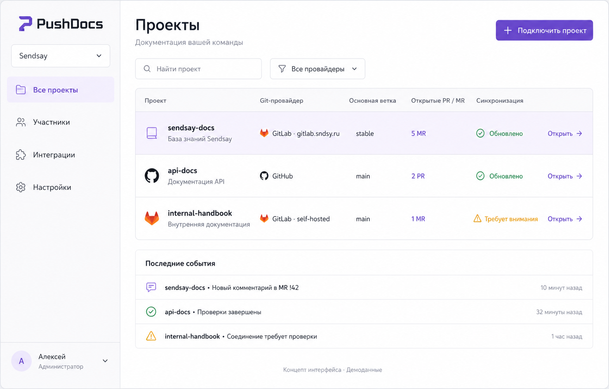
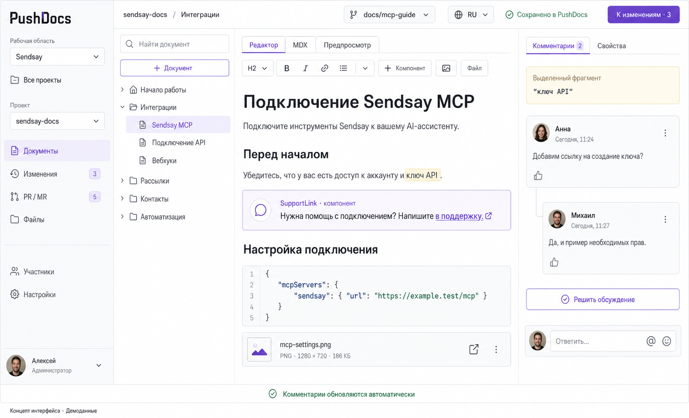
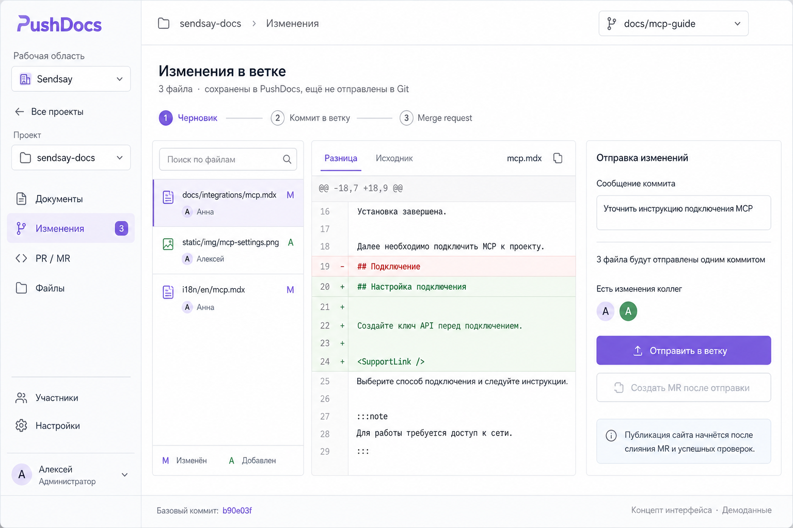
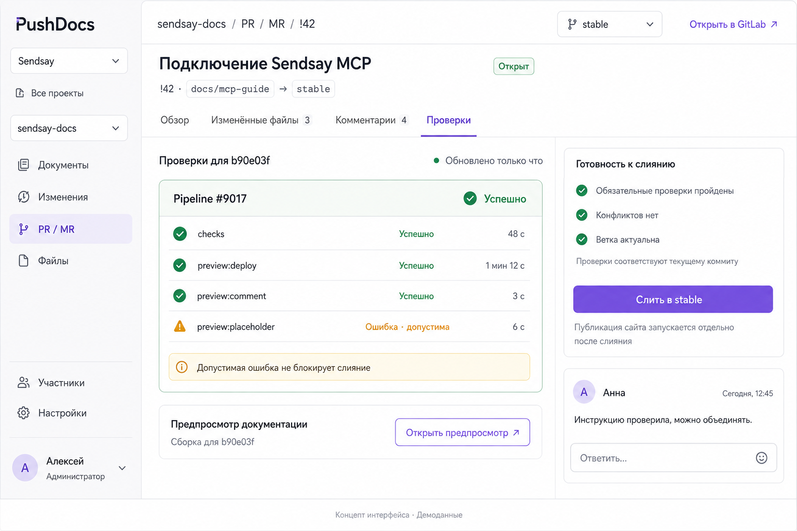
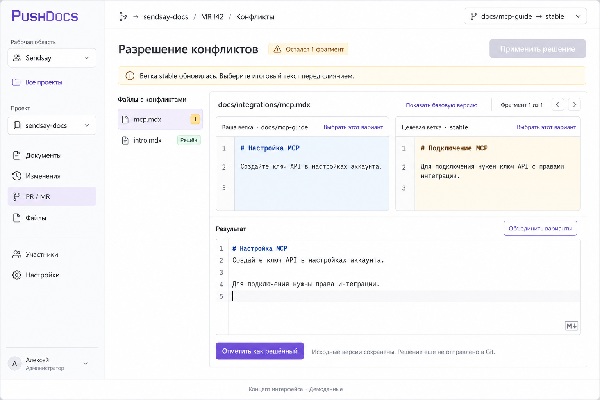
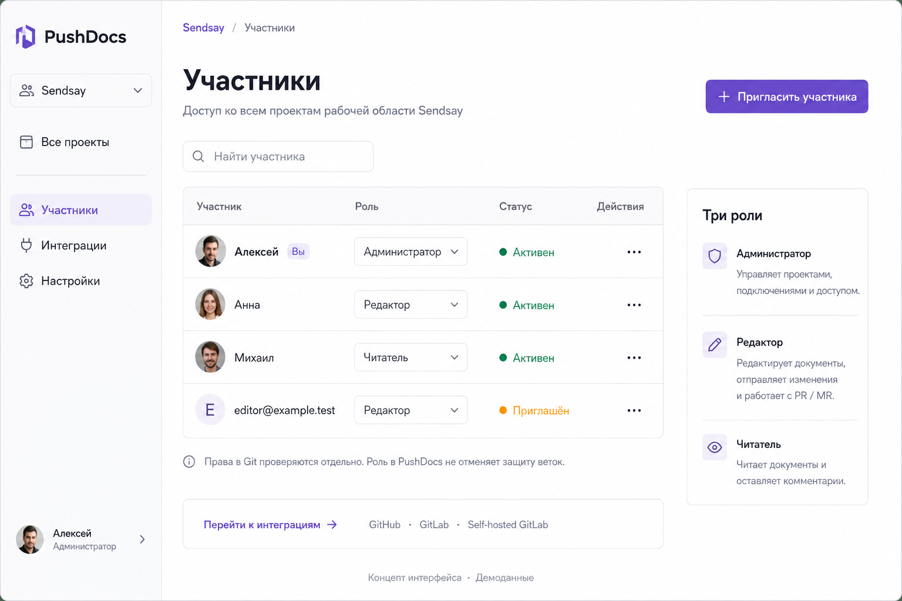

# Макеты интерфейса PushDocs

Макеты показывают предлагаемое расположение разделов и элементов интерфейса. Приложение ещё не реализовано. Имена пользователей, содержимое документов и состояния проверок приведены для примера, даже если используются знакомые номера MR и pipeline.

Картинки созданы встроенным imagegen. Общий стиль и расположение элементов подготовлены с frontend-design. Точные запросы исходной генерации сохранены в [prompts.json](prompts.json); они описывают прежнюю модель и не являются актуальными требованиями.

После создания картинок согласована структура **«Установка → Проекты → Ветки → Документы»**. Рабочие области исключены. PNG сохранены без изменений как ранние концепты: переключатель Sendsay нужно убрать, а роли и экран пользователей перенести на уровень проекта. Актуальные правила приведены в [ADR](../adr/0001-pushdocs-architecture.md).

## Проекты

Стартовый экран показывает только проекты, к которым у пользователя есть доступ. Каждый проект подключён к репозиторию GitHub или GitLab; несколько сайтов одного репозитория могут быть отдельными проектами. Выбирать ветку до открытия проекта не нужно. Общие пользователи, подключения и системные настройки доступны в отдельном разделе владельца.

## Редактор документа

Слева находятся меню проекта и дерево документов. Сверху видны проект, ветка и язык. Комментарии открываются справа. Панель инструментов позволяет вставить компонент или загрузить файл.

Сохранение в PushDocs не означает отправку в Git. Совместное посимвольное редактирование и общие курсоры не предусмотрены.

## Изменения

Перед отправкой в Git пользователь проверяет список файлов и разницу между версиями. Справа находятся сообщение коммита и действие отправки. Изменения коллег показаны явно.

## PR и MR

Проверки привязаны к конкретному коммиту. Допустимая ошибка показана отдельно от ошибки, которая блокирует слияние. Предпросмотр доступен из того же экрана.

Публикация сайта и слияние MR имеют отдельные статусы. Возможность слияния зависит от роли, прав в Git и правил репозитория. В финальном интерфейсе MR будет фиксированная пара исходной и целевой веток вместо независимого переключателя ветки, который появился на концепте.

## Конфликты

Пользователь сравнивает версии из двух веток и редактирует результат ниже. Базовую версию можно открыть отдельно. Применение недоступно, пока остаются нерешённые фрагменты.

## Пользователи

Экран пользователей должен открываться внутри выбранного проекта. Пользователь имеет отдельную роль в каждом проекте, а удаление из одного проекта не меняет доступ к другим. Читатель может оставлять комментарии. Роль в PushDocs не отменяет ограничения Git-провайдера. Подпись на картинке о доступе ко всем проектам устарела.

## Что ещё нужно уточнить

Логотип, размеры и некоторые иконки различаются между концептами. При разработке их нужно привести к единой системе компонентов Base UI. Лица на картинках сгенерированы и не изображают настоящих пользователей проекта.

Разделы файлов, интеграций и настроек обозначены в меню, но ещё не показаны отдельными экранами. Также потребуется спроектировать импорт проекта, выбор ветки, свойства компонентов, загрузку файлов и состояния ошибок.
